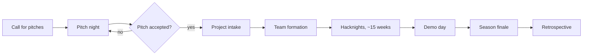

# Process Modelling

[[Process-Index]] records **where** each process is written down. It says nothing about **what a written-down process should look like** — and right now the answer is always prose.

That is not a neutral choice. Prose is why *"who does what"* has three structurally different answers — per-event shifts, per-season owners, standing committees — that coexisted for months without anyone noticing they were incompatible. Three tables in the same shape would have collided on sight. Three essays did not.

This page is the notation shortlist: what the standard process-modelling languages are, which of ours each one actually fits, and what this repo's constraints allow us to use.

---

## The three OMG notations

They are siblings, published by the same body, and they are usually confused with each other because they are usually described in the abstract. They answer three different questions.

| | Full name | Current spec | The question it answers |
| --- | --- | --- | --- |
| **BPMN** | Business Process Model and Notation | 2.0.2, Jan 2014 (also ISO/IEC 19510:2013) | *In what order does this happen, and who does each step?* |
| **CMMN** | Case Management Model and Notation | 1.1, Dec 2016 | *What might need doing, and when is each thing allowed or required?* |
| **DMN** | Decision Model and Notation | 1.5, Aug 2024 | *Given these facts, what is the answer?* |

**BPMN** models a *sequence*. Known steps, known order, a defined start and end, gateways where the path branches, lanes showing who owns which stretch. It assumes the process is repeatable and that deviating from it is an error.

**CMMN** models a *case*. A set of tasks that are available rather than scheduled, each guarded by a condition — a *sentry* — that says when it becomes relevant. Some tasks are mandatory, some are *discretionary*: a competent person may add them if the case warrants. It assumes the worker's judgement is part of the method, not a failure of it.

**DMN** models a *decision*. Inputs in columns, one output column, one row per rule, plus a hit policy saying what happens when several rows match. Its expression language is FEEL. A decision table is the whole point; the diagram layer above it is optional.

### The distinction that actually matters to us

> BPMN describes work where deviating from the model is a defect.
> CMMN describes work where deviating from the model is the job.

Almost everything a volunteer does on a Wednesday night is the second kind, and almost everything we have written down is phrased as the first kind. `Event_Planning_Guide.md` is a five-step outline for an evening that never runs in five ordered steps. That mismatch is a large part of why our procedure docs read as aspirational and get quietly ignored — the same mechanism behind the season doc claiming 12 weeks when the seasons are 15.

---

## How to tell which one you need

| The question you are answering | Shape of the answer | Use |
| --- | --- | --- |
| "In what order does this happen?" | Ordered; deviation is an error | **BPMN** |
| "What might need doing, and when is it allowed?" | Unordered; deviation is the job | **CMMN** |
| "Given these facts, what is the answer?" | Inputs → one output | **DMN** |
| "Did I miss anything?" | Unordered, no conditions, no branching | A plain **checklist** |
| "Who is accountable for this?" | Roles × activities | A **RACI** table |

The last two are not lesser tools. Most of what we run is a checklist, and saying so is more honest than drawing a flowchart around it.

---

## What this would fit, in our own index

Mapping the rows of [[Process-Index]] to the notation each one actually wants:

| Process | Why | Notation |
| --- | --- | --- |
| Season and project lifecycle | Staged, ordered, dated, hands off between people | BPMN |
| Pitching → intake → team formation | Ordered with a real gate: pitches are accepted or not | BPMN |
| Publishing a blog post | Ordered, has a review handoff, currently has no written form at all | BPMN |
| Starting a new project repo | Ordered and already partly automated in `scripts/setup-project.sh` | BPMN |
| Running a hacknight | Setup, greeting, standups, food, teardown — required but not ordered | CMMN |
| Event roles on the night | Who may do what, within a case | CMMN + RACI |
| Sponsorship requests | Long-running, judgement-driven, each one different | CMMN |
| Grant and funding applications | Same — four past applications, no two alike | CMMN |
| **Which surface owns this fact** | One input, one output | **DMN** |
| **Which channel do I post this to** | One of the eight ❌ conflicts, and it is a decision, not a procedure | **DMN** |
| **Marketing or outreach?** | Two inputs, one output | **DMN** |
| Is this repo active? | Inputs → answer; already has a stated rule (last *content* change, not `pushed_at`) | DMN |
| Photo consent | Not a model. A policy plus a control | — |

Three of those are worth pulling out, because **we have already written them as decision tables without noticing.**

### The ownership map is a DMN table in prose

[[Ownership-Model]]'s map is literally one input column (fact type), one output column (owning surface), and a uniform hit policy. It is a decision table that happens to be typeset as documentation. That is a good sign — the rule was well-formed before anyone named the notation.

### The marketing scope rule has an uncovered cell

[[Process-Index]] § Marketing states the scope as *"one-to-many and public"*, with private one-to-one contact routed to outreach. Written out as a table:

| Audience | Visibility | → Pillar |
| --- | --- | --- |
| One-to-many | Public | Marketing |
| One-to-one | Private | Outreach |
| One-to-many | Private | **not covered** |
| One-to-one | Public | not covered |

The third row is the newsletter: one-to-many, but to a private subscriber list. The prose rule as written (`one-to-many` **and** `public`) sends it to outreach; [[Process-Index]] files it under Marketing. Nobody was wrong — the rule was never checked for completeness, because prose cannot be checked for completeness.

**That is the entire argument for decision tables in one example.** No tool was involved. Drawing the grid found the gap.

### Decision tables are a policy that ships with its own control

Project 47's rule is *no policy without a control*. A decision table is unusual in satisfying that by construction — three properties can be checked mechanically, by a person in a minute or a script later:

- **Completeness** — every combination of inputs matches at least one rule.
- **No unintended overlap** — or, if rules do overlap, a declared hit policy.
- **No masked rules** — every row is reachable.

Every doc that drifted in the audit was a policy-like statement with nothing checking it. This is the cheapest available exception.

---

## Related things, and why we are not adopting most of them

| | What it is | Verdict |
| --- | --- | --- |
| **UML activity diagrams** | Predates BPMN; similar expressive power | Skip — BPMN covers it with better tooling for non-engineers |
| **ArchiMate** | Enterprise architecture: capabilities, actors, applications, their dependencies | Skip — the one thing we would model with it, the surfaces map, already exists as a table on [[Documentation-Surfaces]] |
| **C4 model** | Software architecture at four zoom levels | Not process. Belongs in project repos, not the register |
| **Event storming** | A *workshop* format — sticky notes, domain events on a wall — not a notation | **Keep in mind.** It is the cheapest on-ramp we have: one hacknight, no software, output is a first-pass process map |
| **Value stream mapping / SIPOC** | Lean; measures flow, handoffs and waste | Skip — these measure throughput problems, and ours are gaps, not bottlenecks |
| **RACI** | One table: activities × roles, marked Responsible / Accountable / Consulted / Informed | **Adopt.** The cheapest possible fix for the roles conflict, and it needs nothing but a markdown table |
| **Checklists** | An unordered list of things that must be true before you are done | **Adopt.** Honestly the right notation for most of what we run |
| **ADRs** (architecture decision records) | A dated record of a decision made *once*, with its context and consequences | Already in use in spirit — [[Ownership-Model]] is an ADR. DMN is for decisions made *repeatedly*; an ADR is for the decision to adopt DMN |
| **BPEL, XPDL** | Execution and interchange formats for process engines | Irrelevant. We have no engine, and never will |
| **Mermaid, PlantUML** | Diagrams-as-text, rendered by the host | Not process notations, but the only diagram tooling that is diffable and needs no install |

---

## What this repo's constraints allow

Five of them, and together they rule out more than the notations do.

**1. Model sources are not notes.** The site publishes `01 - Evergreen/` only, so model *source* files live in `02 - Attachments/` and the published page embeds or links the rendered output. Nesting is no longer a constraint — this page previously said the wiki was flat, which was true of the GitHub Wiki and is not true of the Quartz site that replaced it. See [[Editing-These-Docs]].

**2. BPMN, CMMN and DMN files render on none of our surfaces.** They are XML. A `.bpmn` file in a pull request is an unreviewable blob; GitHub, Discourse and this site all show it as text. Anything we commit needs a companion SVG, or needs to be text in the first place.

**3. A model that cannot be diffed will drift — which is the disease this entire register documents.** BPMN XML technically diffs, but nudging one box's layout produces a hundred-line diff, and a hundred-line diff gets rubber-stamped. Rubber-stamped changes are how the FAQ ended up pointing at Meetup.

**4. No third-party Actions.** The org restricts Actions to GitHub-owned, Marketplace-verified, `peaceiris/*` and `ruby/*`. Every off-the-shelf BPMN-to-SVG action is third-party, so automated rendering needs a policy exception before it needs a workflow.

**5. One owner per fact — which applies to diagrams too.** A model of a process that leaves the prose version in place has not documented anything; it has created finding 14. If we draw the season lifecycle, the drawing replaces the paragraph, and the paragraph links to it.

---

## Recommendation

Tiered, cheapest first. Nothing here needs a purchase, an install, or a policy exception.

**Now — no tooling at all.**
Write the decisions as decision tables, in markdown, in the page that already owns them. Start with the three named above: which surface owns a fact, which channel to post to, marketing vs. outreach. Add a RACI table for event roles. Check each for completeness and overlap before merging; that check is the control.

**Next — if a diagram earns its place.**
One Mermaid `flowchart` for the season lifecycle, inline in the page. One file, diffable, renders where GitHub renders Mermaid, no install:

*Verified 2026-08-30:* GitHub renders Mermaid in repository Markdown, and Quartz renders it too — its `obsidian-flavored-markdown` plugin parses Mermaid by default (`mermaid: true`). The old note here said wiki rendering was untested; that question is moot now that the GitHub Wiki has been retired.

**Later — only if we outgrow markdown.**
Real BPMN or CMMN, authored in Camunda Modeler or bpmn.io (both free, both write standard `.bpmn` / `.cmmn` XML). Source in a `process-models/` directory at the repo root; SVG exported by hand and committed beside it; the page embeds the SVG. Revisit automated rendering only if the manual export becomes the thing people skip.

**Not at all.**
Anything needing a process engine, a server, a licence, or a CI step we cannot run under the Actions policy. We are modelling to make volunteer work legible, not to execute it.

---

## The honest caveat

Notation is not the bottleneck. Ten of fifteen marketing processes have **nothing written down in any form**, and a missing BPMN diagram is exactly as useful as a missing paragraph. Modelling helps where a process exists and is ambiguous or contested — the eight ❌ rows on [[Process-Index]] — and helps not at all where a process exists only in someone's head.

Use it there. See [[Remediation-Checklist]] for the order of work.
